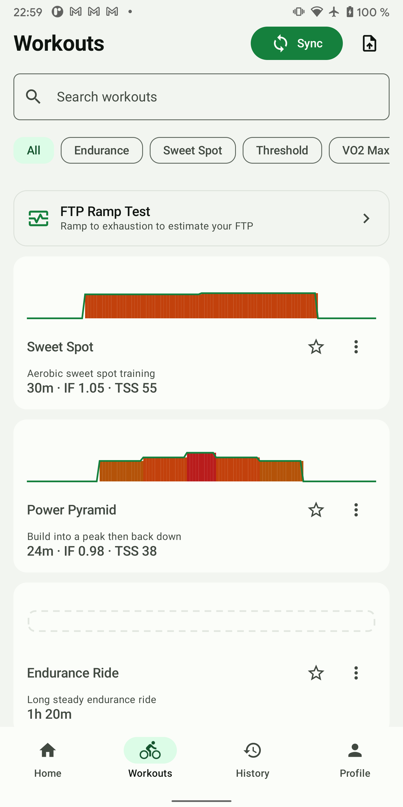
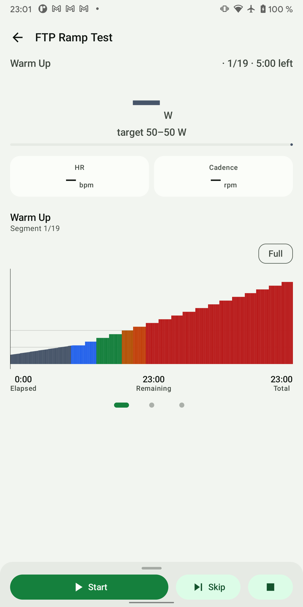
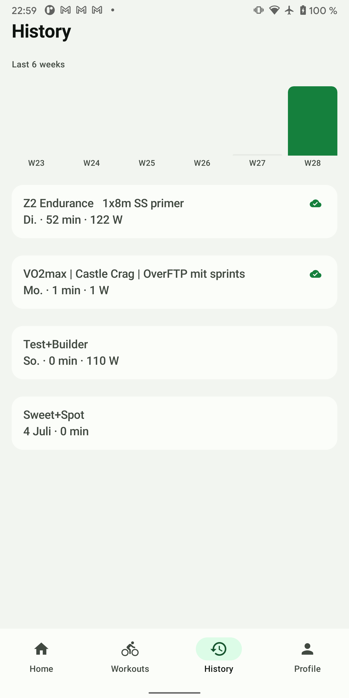
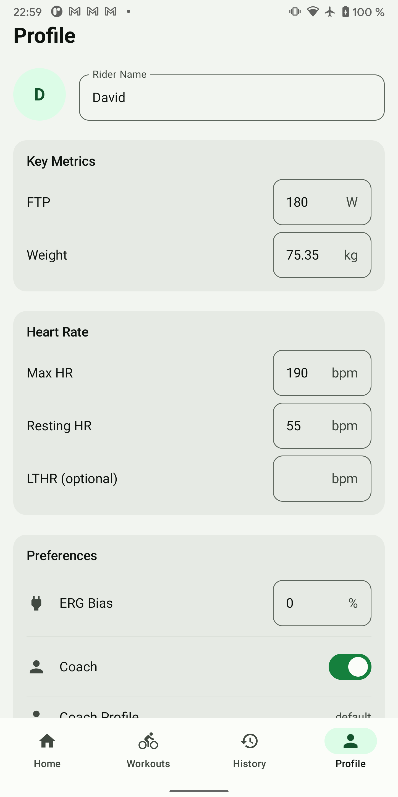
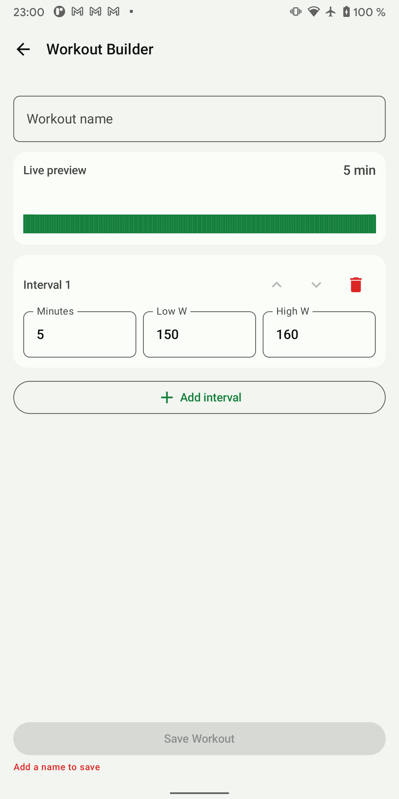
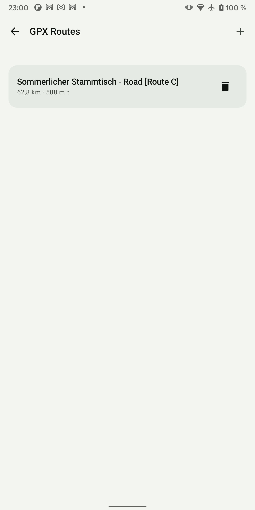
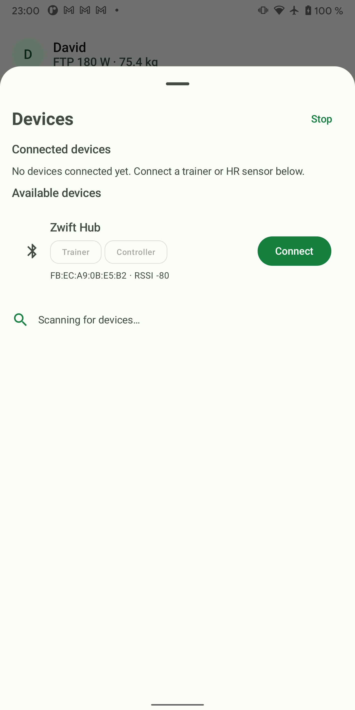

# TrainerLoop — current app screen and product brief

Prepared for a product/UI designer from the running Android app and its implemented feature set. Screenshots were captured on the app's target device, a Pixel 2 XL (portrait, 1440 × 2880-class display), on 11 July 2026.

## 1. Product in one paragraph

TrainerLoop is a personal indoor-cycling computer for one rider. It connects directly to a Bluetooth smart trainer and optional heart-rate sensor, controls trainer resistance or ERG target power, runs structured workouts, simulates outdoor GPX routes, supports open-ended free rides, gives live spoken coaching, records full telemetry, exports FIT files, and can exchange athlete/workout/activity data with intervals.icu. It is deliberately a local-first, single-user utility rather than a social fitness service: there is no sign-in, feed, subscription, or multi-athlete model.

The key experiential split is:

1. **Before riding:** connect hardware, choose/import/build a workout or route, and review it.
2. **During riding:** read power, heart rate, cadence, target and interval context at a glance; control the session with sweaty hands.
3. **After riding:** review performance and coaching feedback, save/share a FIT file, and optionally upload it.

## 2. Information architecture

The persistent bottom navigation has four destinations:

- **Home:** rider status and fastest paths to riding.
- **Workouts:** searchable/filterable workout library and ramp test.
- **History:** six-week training-load overview and completed sessions.
- **Profile:** rider physiology, coaching, simulation, integration, and app preferences.

Secondary flows remove the bottom navigation and use a back affordance or modal sheet:

- Bluetooth devices
- Workout builder
- Workout preview
- Structured workout player
- Workout completion/summary
- GPX route list and route detail
- Route/free-ride player
- Session detail

## 3. Current visual language

The app uses Material 3 with a restrained cycling/sport palette:

- Warm near-white page background with white or pale-gray cards.
- Green is the brand/action/selected color. Pale mint identifies selected navigation and chips.
- Power-zone charts introduce blue, green, orange, and red; red is also used for destructive actions and validation.
- Typography is mostly bold, large sans-serif headings with dark gray body text. Numeric ride values become the strongest visual element in the player.
- Components favor large rounded rectangles: cards, input outlines, chips, bottom-nav selection pills, and full-width primary buttons.
- Icons are simple Material symbols. Some actions rely on icon-only controls (import, favorite, overflow, delete).
- Spacing is generous, sometimes producing large empty areas on sparse states. The visual system is functional and calm, but hierarchy, density, and component styling vary between screens.

## 4. Main screens

### 4.1 Home / ride launchpad

**Purpose:** answer “am I ready, and what can I ride?” with the fewest steps.

**Visible structure:**

- A tappable rider header shows an initial avatar, rider name, FTP, and weight; it links to Profile.
- The dominant **Ready to ride?** hero contains a full-width **Start Free Ride** action.
- A narrow connection strip shows trainer and heart-rate status. Tapping it opens the Devices bottom sheet.
- Two utility rows link to **Workout Builder** and **GPX Routes**.
- **Recent Workouts** shows the latest completed ride with date, duration, and representative/average power.
- The four-item bottom navigation remains visible.

**Conditional state not present in this capture:** when intervals.icu has a workout planned for today, Home can show a planned-workout card with name, type, duration and target power plus **Quick Start**. The app downloads/parses the workout and opens the player directly.

**Design implications:** Home currently mixes identity, connection health, starting, creation/import, planning, and history. The redesign should make trainer readiness unmissable, preserve a one-tap free ride, and decide whether “today's plan” or “start anything” is the primary story.

### 4.2 Workout library

**Purpose:** find, import, synchronize, manage, preview, and start structured workouts.

**Visible structure and behavior:**

- Top-level title plus prominent green **Sync** button and an icon-only file-import action.
- Search field filters by workout name/description.
- Horizontally scrolling category chips include All, Endurance, Sweet Spot, Threshold, and VO2 Max.
- A dedicated **FTP Ramp Test** row sits above the regular library.
- Workout cards contain a zone-colored miniature power profile, title, description, duration, Intensity Factor (IF), and Training Stress Score (TSS).
- Star toggles favorites. Overflow actions support duplicate and, where allowed, delete.
- Supported imports are Zwift `.zwo`, `.mrc`, `.erg`, and TrainerLoop JSON. Imported and built workouts join the same library.
- Selecting a normal card opens a preview with the complete profile, duration/IF/TSS summary, interval list, and **Start Workout** action. The ramp-test row launches its specialized player directly.

**Design implications:** the screen carries several different acquisition models—built-ins, local imports, manual builds, and remote sync—without explaining their provenance. The workout chart is the strongest recognition cue and should remain prominent. Category, favorite, and ownership/provenance could be made more legible.

### 4.3 Workout player (pre-start state)

**Purpose:** function as the rider's live dashboard and session controller. This is the highest-priority safety/readability screen.

**Visible pre-start state:**

- Top app bar provides back navigation and workout name.
- Interval context names the current segment and shows position in the workout plus time left.
- The central power hero displays actual watts (unavailable before trainer data) and the target range.
- A thin indicator communicates whether actual power is inside the acceptable target zone.
- Heart rate and cadence appear in two secondary metric cards.
- Current interval name and number sit above a large, zone-colored workout profile. A **Full** control changes the chart framing.
- Footer statistics show elapsed, remaining, and total time.
- Pager dots indicate additional data pages.
- A persistent bottom control sheet offers a large Start/Pause/Resume button, Skip, and Stop. Pulling it up exposes ERG, intensity bias, recovery extension, and finish controls.

**During an active workout:** actual power becomes a very large zone-colored value; the chart cursor auto-follows progress; target-versus-actual response, time-in-zone, coach messages, interval-change tone, and spoken call-outs provide feedback. Users can toggle ERG, adjust intensity bias in ±1%/±5% steps (within ±20%), skip an interval, or add 30 seconds to a recovery interval. The workout continues under a foreground service, maintains the BLE link with auto-reconnect, and keeps the screen awake while running.

**Landscape mode:** the UI becomes an immersive, full-width workout chart with large metrics and 1×/2×/4×/8× zoom. This must be treated as a first-class responsive layout, not merely rotated portrait.

**Design implications:** optimize for glanceability at distance, motion, sweat, fatigue, and limited tap accuracy. Power, target, interval time, HR, cadence, connection loss, and transport state need a rigorous priority order. Destructive Stop/Finish must remain distinct from frequent controls without becoming hard to reach.

### 4.4 History

**Purpose:** provide a lightweight training-load overview and entry point into past sessions.

**Visible structure:**

- “Last 6 weeks” load chart uses one bar per calendar week, labeled by week number.
- Session cards show workout name, localized date/day, duration, and average power.
- A green cloud/check badge denotes successful upload/sync state.
- Selecting a session opens detailed performance data.

**Session detail capabilities:** workout/date heading, a summary chart, duration and power statistics, time in power zones, coach-session summary/feedback, FIT sharing, and manual upload/retry to intervals.icu. The underlying ride record contains timestamped power, heart rate, cadence and related trainer telemetry.

**Design implications:** the existing overview is intentionally simple, but it does not yet tell a training story beyond weekly volume/load and a flat activity list. A redesign can improve comparison and scanability without implying analytics the product does not compute.

### 4.5 Profile and settings

**Purpose:** configure the one rider and the behavior of the trainer, coaching, simulation, and integrations.

**Visible upper section:**

- Editable rider name and initial avatar.
- **Key Metrics:** FTP and weight.
- **Heart Rate:** maximum HR, resting HR, and optional lactate-threshold HR.
- **Preferences:** ERG bias, coaching on/off, and coach-profile selection (continues below the fold).

**Further settings below the captured fold:**

- Five data-driven coach personalities: Default, Mentor, Drill Sergeant, Silent Scientist, and Base Builder.
- Power-zone and heart-rate-zone views derived from FTP/max HR.
- Simulated rider/route physics, including parameters such as rolling resistance and aerodynamic drag, with advanced controls and reset-to-defaults.
- intervals.icu Athlete ID and API key, enabling planned-workout sync, FTP/weight sync, and FIT upload.
- About/version information.

**Behavior:** values are persisted locally and feed directly into targets, zone coloring, workload calculations, route physics, and coaching. Profile is therefore both personal identity and technical setup; many fields have significant downstream effects.

**Design implications:** organize by mental model (Athlete, Coaching, Trainer/Ride behavior, Connections, App) and explain consequences near sensitive values. API credentials and advanced physics should not compete visually with frequently adjusted rider metrics.

### 4.6 Workout builder

**Purpose:** quickly create a local stepped-interval workout without using a desktop editor.

**Visible structure and behavior:**

- Workout name field.
- Live zone-colored preview and total duration.
- Reorderable interval cards. Each interval has duration in minutes, low watts, high watts, move-up/down controls, and delete.
- **Add interval** appends another step.
- Sticky **Save Workout** action; inline validation explains why save is disabled.
- Saving returns to the workout library, where the new workout behaves like imported content.

**Design implications:** this is a pragmatic numeric editor rather than a visual timeline editor. A redesign should preserve speed for repeated numeric entry while making the difference between a fixed target and low–high target range clear. Reordering and validation need stronger affordances and accessible touch targets.

### 4.7 GPX routes

**Purpose:** import and manage outdoor routes for simulated indoor rides.

**Visible structure and behavior:**

- Back navigation and **GPX Routes** title.
- Icon-only plus action opens the Android file picker for `.gpx` import.
- Each route row shows route name, distance, and total ascent; delete is immediately available.
- Selecting a route opens a detail screen with elevation profile, distance/ascent and route statistics, then **Start Ride**.

**Ride simulation:** gradient from the route changes trainer resistance. A local physics model combines power, gradient, rider parameters, rolling resistance, and aero drag to derive virtual speed and progress. The free-ride UI shows speed, power, HR, cadence, distance, gradient, elapsed time and virtual gear. Volume keys can shift the virtual drivetrain.

**Design implications:** route recognition currently depends almost entirely on a long filename. Elevation shape is available and is a natural visual identity for each route. Delete is unusually prominent for a destructive, infrequent action.

### 4.8 Bluetooth devices sheet

**Purpose:** discover, connect, identify, and disconnect ride hardware while retaining Home as context.

**Visible structure and behavior:**

- Presented as a tall modal bottom sheet over Home with a drag handle.
- Separate **Connected devices** and **Available devices** sections.
- Scan/Stop action and animated scanning placeholder.
- Device rows include Bluetooth icon, advertised name, capability badges (for example Trainer and Controller), hardware address, signal strength (RSSI), and Connect.
- The app can aggregate capabilities from the smart trainer/controller and separately connect a heart-rate sensor. Connected cards expose Disconnect.
- Permission or Bluetooth errors appear as banners/messages with corrective actions. Home reflects trainer and HR state after dismissal.

**Design implications:** technical identifiers help debugging but compete with the user's basic question: “is this my trainer and is it ready?” Capability and connection state should be more semantic, while RSSI/MAC can move to secondary disclosure. Device loss and automatic reconnection during a ride need unmistakable but non-panicking feedback.

## 5. Important uncaptured states

These are implemented and should be included in redesign concepts even though the live device did not have a convenient deterministic state for a clean screenshot:

- **Workout preview:** full workout profile, key workload pills, expanded interval list, Start Workout.
- **Route detail:** elevation hero, route statistics, Start Ride.
- **Active free/route ride:** live speed, power, HR, cadence, distance, gradient, virtual gear, start/pause/resume and stop.
- **Workout complete:** completion heading, duration/power summary, coach summary, Save/Discard, Share FIT, upload state, and Done.
- **Ramp-test result:** estimated FTP with explicit Accept FTP, Discard FTP, or Later decision.
- **Stop confirmation:** structured workouts explain that the ride will be saved; route/free rides say the ride so far will be saved.
- **Connection and data states:** scanning, connecting, connected, permission denied, Bluetooth unavailable, signal lost, auto-reconnecting, telemetry unavailable/stale.
- **Empty/loading/error states:** no recent sessions, no routes, no search results, sync in progress/failure, upload in progress/failure, and invalid import.
- **Landscape workout:** immersive zoomable chart and live metrics.

## 6. Core concepts and vocabulary

- **FTP:** Functional Threshold Power, in watts; anchors power targets and zones.
- **ERG mode:** app commands a target wattage and the trainer automatically varies resistance to hold it.
- **Bias:** temporary percentage adjustment to prescribed workout intensity.
- **IF:** Intensity Factor, a normalized indication of workout intensity relative to FTP.
- **TSS:** Training Stress Score, combining duration and intensity.
- **Power zones:** color bands used throughout workout charts and live power feedback.
- **Segment/interval:** one timed section of a structured workout, with a target or target range.
- **Free ride:** open-ended ride without a predefined route or workout.
- **Virtual route:** GPX elevation-driven simulation with calculated speed and distance.
- **FIT:** standard activity file format saved/shared/uploaded after a ride.
- **Coach:** rule/analytics-driven live feedback with text-to-speech; not a conversational chatbot.

## 7. Redesign constraints and priorities

1. **Workout readability is safety-critical.** The rider may be several feet away, breathing hard, and able to glance for less than a second.
2. **Touch targets must tolerate sweat and motion.** Frequent controls should be large, stable, and visually separated from destructive actions.
3. **Hardware state is part of every ride flow.** Connected, stale, lost, and reconnecting cannot be relegated to a setup screen.
4. **Portrait and landscape are distinct use cases.** Portrait supports setup and general use; landscape is an immersive live dashboard.
5. **Preserve offline/local-first behavior.** Remote sync is optional and must not make local workouts or rides appear unavailable.
6. **Do not assume a broad consumer audience.** The current owner understands cycling metrics, but good labeling and progressive disclosure are still valuable.
7. **The app is single-user.** Avoid account-switching or social patterns that add architecture the product does not need.
8. **Keep zone color meaningful.** Red in charts means high power, while red elsewhere means destructive/error; context and accompanying shape/text must prevent ambiguity.
9. **Design for absent telemetry.** Dashes and stale values are normal before connection or during a dropout, not exceptional edge cases.
10. **Use real data variability.** Names can be long, rides can last hours, intervals can number in the dozens, and imported route/workout titles may be messy.

## 8. Suggested redesign deliverables

A useful proposal should cover more than polished versions of the four tabs:

- Navigation and screen hierarchy.
- Home with and without a planned workout, and with disconnected/connected hardware.
- Workout library, search/filter, import/sync, and workout preview.
- Workout player in pre-start, active, paused, connection-lost, and landscape states.
- Player controls expanded, stop confirmation, and workout completion.
- History overview and session detail.
- Profile/settings information architecture.
- Devices sheet in scanning, connected, and error states.
- GPX list, route detail, and active virtual ride.
- Workout builder with multiple intervals and validation.
- A small component/state specification for buttons, cards, chips, metrics, zone colors, charts, connection badges, loading, empty, and error states.

## 9. Screenshot index

| File | Screen/state |
|---|---|
| `01-home.png` | Home, trainer and HR disconnected |
| `02-workouts.png` | Populated workout library |
| `03-history.png` | Six-week history with sessions |
| `04-profile.png` | Profile/settings, upper portion |
| `05-workout-builder.png` | New workout, one default interval, validation state |
| `06-gpx-routes.png` | GPX route library with one imported route |
| `07-devices.png` | Scanning device sheet with a discovered smart trainer |
| `09-workout-player.png` | FTP ramp-test player before Start, telemetry unavailable |

All images are in [`screenshots/`](screenshots/). They show real local data from the connected phone; names, ride titles, and device identifiers should be replaced with neutral sample data before public distribution.
